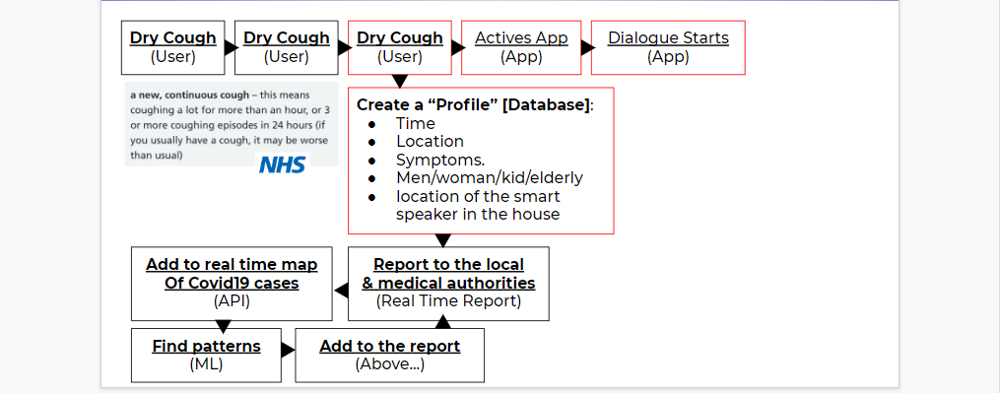

# Build For COVID19

**Mentor:** Nicolas Chevobbe, Jan Odvarko, Jason Laster, Florian Merz, Anne van Kesteren Sapolia

**Email:** nchevobbe@mozilla.com, honza@mozilla.com, jlaster@mozilla.com, fmerz@mozilla.com, annevk@annevk.nl

## Project Description

Build a POC to address the challenges COVID is creating for people that detect people having a dry cough. 

- `Focusing on the specific theme: #HEALTH`

## Skills Required

A list of whatever skills, tools or experience somebody might need to complete this project successfully. 

An applicant must needs to familiar with

- Front-end web development (JavaScript, HTML, CSS).
- A good knowledge of all Voice Stacks/Frameworks (RASA, Google Assistant, Dialogflow, NodeJS, Firebase, REST APIs). 
- A good understanding of AWS, NLU, NLP, SSML 
- Be productive with version control systems (e.g. Git or Mercurial).
- Think critically and be able to independently investigate/debug issues.

Knowledge of AI, ML is a plus bonus

## Project Details

A voice app that detect people having a dry cough (It’s like Corona tracking BEFORE users even know they have corona)

- Guiding users to wash their hands afterwards and to take their temperature (if they are coughing more than 3 times a day or more coughing more than 1h - Covid19 symptoms according to the NHS) 
- The app will guide the user with medical instructions and alert local authorities & medical 
staff if the cough and user’s temperature is getting worst  - so they can respond. 

Today Voice/apps solutions don’t offer seamless CX...

- Apple siri’s voice assistant provides coronavirus advice (Pulling information from US health authorities)
- Facebook crafted an Whatsapp chatbot (in UK) 
- Google asks users about symptoms for Carnegie Mellon coronavirus forecasting effort.
- Alexa Symptom check Skill

What needs to learn

- Detect Sneeze & cough sounds
- Medical guidance to light/medium/heavy case
- chat about the CX & Dev
- sharing tasks and collab

Reports to the local & medical authorities IN REAL TIME
1. Location (per house & city) of the “events”
2. Sneeze or/and cough or running nose sounds (amounts & frequency)
3. Cross-data with Corona API of already cases locations
4. ML to find patterns (and if so.. Report it in real time)

## Additional Information

- User install the Voice app naming as “achoo” on (web/google assistant)
- The app opens up and “listen” to every sounds.
- The ML/AI here recognize a cough or a sneeze sound and give instructions to google assistant/voice app on detection
- Google Assistant/voice app will then take information and send that script to following medical “procedure”
- users coughs & sneezes saved in a secure database (Align to GDPR) 
- Find pattern (location & timings) using ML/AI
- Send alerts or daily reports to local/medical authorities
- In a sneeze... operates chat automation. And start a chatbot dialog with the user to guide them what to do next.

## Flow diagram

